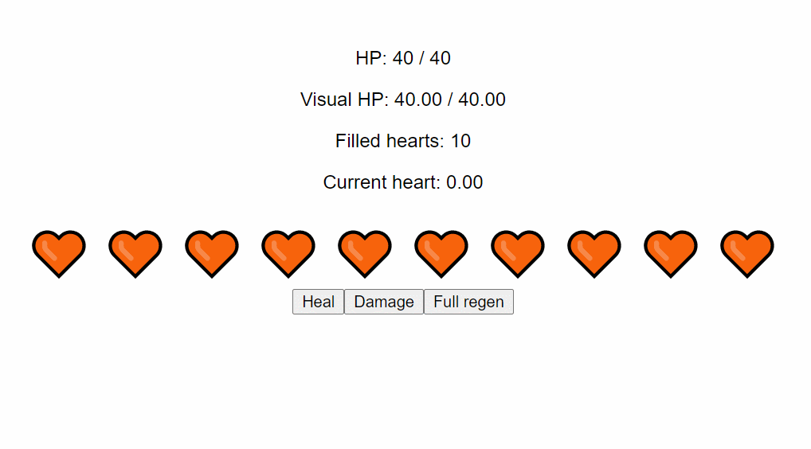

# Animated Heart Bar

An animated heart bar based on the one from The Legend of Zelda: Breath of the Wild.



## How it works

The `HeartBar` component takes two props: `health` and `maxHealth`.

This component will keep track of the health value, and keep an internal value that smoothly transitions any changes made to the input value (currently thanks to [VueUse's useTransition][1]).

The amount of hearts rendered depends on the input max health as well as the `healthPerHeart` internal value.

Each heart has a foreground and a background, and is assigned a value from 0 to 1. In order to achieve the radial fill effect, the [CSS `clip-path` property][1] is used in combination with a dynamically created SVG circle path.

## Install dependencies

```bash
npm install
# or
yarn install
```

## Fire up dev server

```bash
npm run dev
# or
yarn dev
```

## License

MIT

[1]: https://vueuse.js.org/core/useTransition/
[2]: https://developer.mozilla.org/en-US/docs/Web/CSS/clip-path
